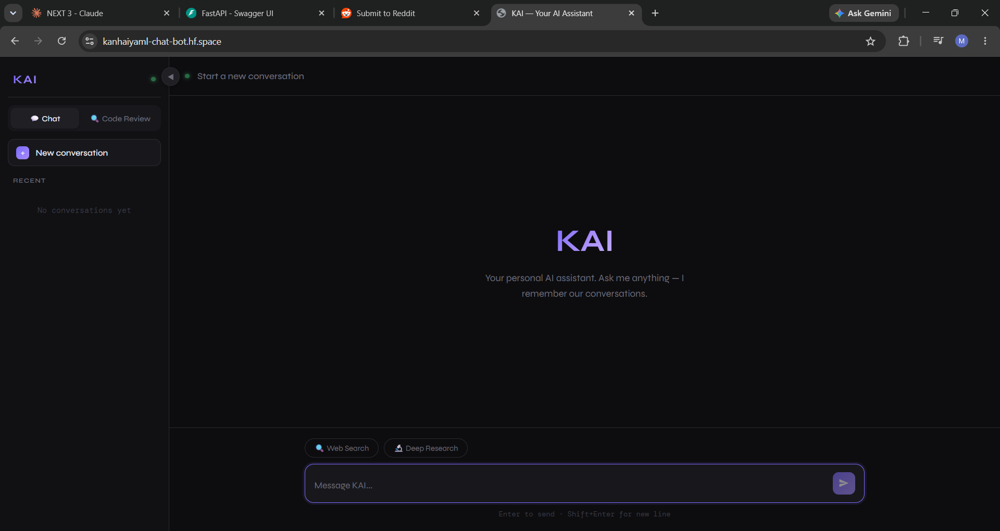
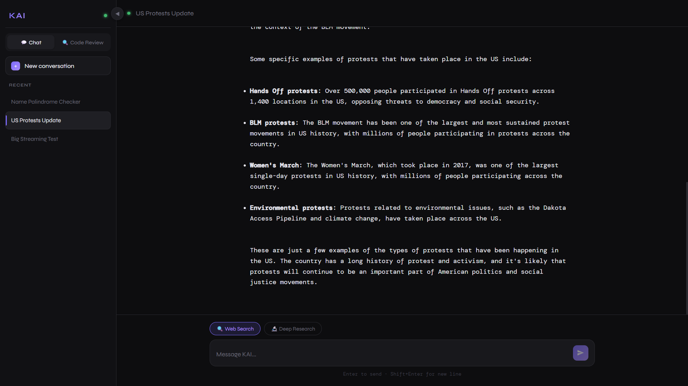
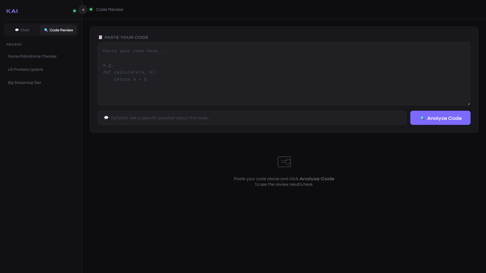

# 🤖 KaiBot

An AI-powered chatbot that combines conversation memory, web search, deep research, and code review capabilities into a single intelligent assistant.

KaiBot is designed to provide context-aware conversations while leveraging external tools to deliver more accurate and useful responses. The project demonstrates modern AI engineering concepts such as memory management, tool integration, agent workflows, and retrieval of real-time information.

---

## 🚀 Live Demo

🔗 Demo: https://kanhaiyaml-chat-bot.hf.space/

🎥 Demo Video: 

https://github.com/user-attachments/assets/c1186d90-9e7a-4a83-bde3-66bb38d57b12


---

## ✨ Features

### 🧠 Persistent Memory

* Remembers previous conversations.
* Maintains context across interactions.
* Enables more natural and personalized responses.

### 💬 Chat History Management

* Stores conversation history.
* Allows users to continue previous discussions.
* Improves long-term conversational context.

### 🌐 Web Search Integration

* Retrieves up-to-date information from the internet.
* Enhances response quality beyond model knowledge.
* Provides more relevant and current answers.

### 🔍 Deep Research

* Collects information from multiple sources.
* Synthesizes findings into concise responses.
* Helps users perform detailed research tasks.

### 💻 Code Review Assistant

* Analyzes source code.
* Identifies potential issues and improvements.
* Provides suggestions for better code quality.

### 🛠 Multi-Tool Workflow

* Dynamically selects the appropriate capability based on user requests.
* Combines memory, search, research, and code analysis into one system.

---

## 🏗 Architecture

```text
User Query
    │
    ▼
 KaiBot
    │
    ▼
 Decision Layer
 ├── Memory Retrieval
 ├── Web Search
 ├── Deep Research
 └── Code Review
    │
    ▼
 Language Model
    │
    ▼
 Final Response
```

---

## 🧠 AI Concepts Demonstrated

* Conversational AI
* Agent Workflows
* Tool Calling
* Memory Management
* Context Preservation
* Prompt Engineering
* Information Retrieval
* Multi-Tool Reasoning
* AI-Assisted Code Analysis

---

## ⚙️ Tech Stack

### Programming Language

* Python

### AI Frameworks

* LangGraph
* LangChain

### AI Capabilities

* Large Language Models (LLMs)
* Conversation Memory
* Tool Integration
* Web Search
* Deep Research Workflows

### Development Tools

* Git
* GitHub

---

## 📸 Screenshots

### Chat Interface



### Web Search Results



### Code Review



---

## 📂 Project Structure

```text
kai-bot/
│
├── app.py
├── requirements.txt
├── chatbot/
├── tools/
├── memory/
├── static/
├── templates/
└── README.md
```

*(Update structure according to your actual project.)*

---

## 🛠 Installation

### Clone Repository

```bash
git clone https://github.com/kanhaiya-ML/kai-bot.git
```

### Move into Project Directory

```bash
cd kai-bot
```

### Install Dependencies

```bash
pip install -r requirements.txt
```

### Run Application

```bash
python app.py
```

---

## 🎯 Challenges Solved

* Maintaining conversation memory across sessions.
* Managing long conversation histories efficiently.
* Integrating multiple AI tools within a single interface.
* Handling web search and information retrieval workflows.
* Creating a seamless user experience for different AI capabilities.

---

## 📈 Future Improvements

* Retrieval-Augmented Generation (RAG) support.
* Document upload and question-answering.
* Multi-agent architecture.
* Voice interaction.
* User authentication.
* Source citations for research responses.
* Advanced evaluation and monitoring systems.

---

## 💡 Why This Project Matters

Many chatbots focus only on text generation. KaiBot extends beyond basic conversations by combining memory, research, web search, and code analysis into a unified AI assistant. The project demonstrates practical AI engineering skills required for building real-world AI products and agent-based systems.

---

## 👨‍💻 Author

**Kanhaiya Kumar**

GitHub: https://github.com/kanhaiya-ML

If you found this project useful, consider giving it a ⭐ on GitHub.
